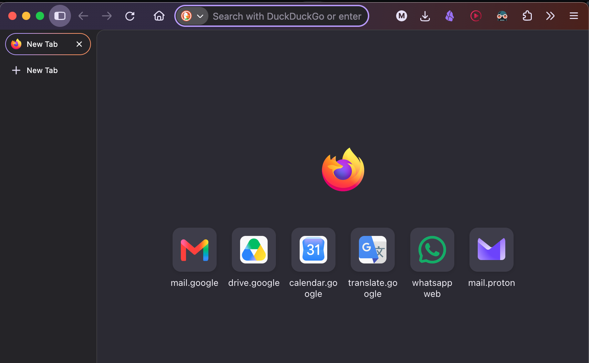
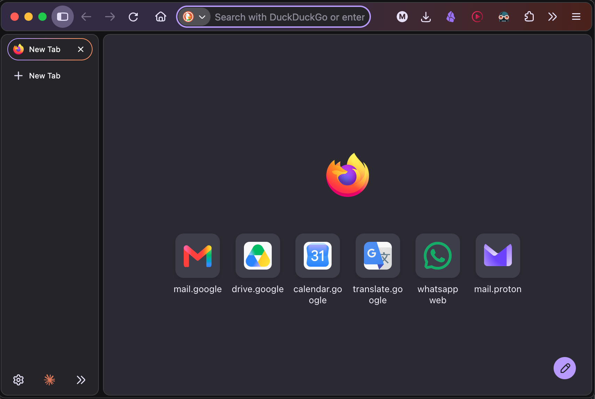

# firefox-nova-islands

Bring back the **floating islands** look of Firefox's Nova redesign: gaps between the toolbar, the sidebar and the page, with rounded, bordered blocks.

Firefox 156 removed those gaps ([bug 2062351](https://bugzilla.mozilla.org/show_bug.cgi?id=2062351), [bug 2063294](https://bugzilla.mozilla.org/show_bug.cgi?id=2063294)), and no setting brings them back. This repo re-applies the CSS rules those patches deleted. They're copied from the Firefox 155.0.1 source code and loaded through `userChrome.css`.

## Before / after

**Firefox 156 default (dark)**



**With firefox-nova-islands (dark)**



**Firefox 156 default (light)**


**With firefox-nova-islands (light)**


## What you get

It behaves the same as Firefox 155:

| Window state    | Result                                                                                                         |
| --------------- | -------------------------------------------------------------------------------------------------------------- |
| Normal window   | 4px gap around the window edge and between the toolbar, sidebar and page. All blocks are rounded and bordered. |
| Maximized       | No gap at the window edge. The gaps between the toolbar, sidebar and page stay.                                |
| Fullscreen      | No outer gap and no rounding. The gap between the sidebar and the page stays.                                  |
| Compact density | 2px gaps. Only the inner corner is rounded.                                                                    |

It also covers split view, docked DevTools, the expand-on-hover sidebar, sidebar on the right, customize mode, and themes.

Colours are Firefox 155/156's: solid toolbar and sidebar blocks. Firefox 157 made those translucent and moved the toolbar gradient to the window background, so the CSS pins the older colours for the default theme. Installed themes keep their own colours.

It only does something when Nova is on. Nova is on by default from Firefox 157. On Firefox 156, turn it on by setting `browser.nova.enabled` to `true` in `about:config`.

## New tab colours (optional)

Firefox 157 also changed the new tab page from charcoal to a much darker palette. `nova-newtab.css` brings back the Firefox 155/156 colours: the page, the shortcut tiles and cards, and the search box, in dark and light mode. Only colours change; the layout of the page (widgets, stories) is Firefox's own.

It is separate and optional: add `--newtab` (macOS/Linux) or `-NewTab` (Windows) when you install. It is loaded through `userContent.css`.

## Install

Close Firefox first, or restart it afterwards.

### macOS / Linux

```sh
git clone https://github.com/matteoninotti/firefox-nova-islands.git
cd firefox-nova-islands
./install.sh
```

Or, without cloning:

```sh
curl -fsSL https://raw.githubusercontent.com/matteoninotti/firefox-nova-islands/main/install.sh | bash
```

Add `--newtab` to either command (for example `./install.sh --newtab`, or `... | bash -s -- --newtab`) to also restore the new tab colours.

### Windows (PowerShell)

Download and unzip the repo (**Code → Download ZIP**), then run this in that folder:

```powershell
powershell -ExecutionPolicy Bypass -File .\install.ps1
```

Add `-NewTab` (for example `.\install.ps1 -NewTab`) to also restore the new tab colours.

### What the installer does

The installer lists your Firefox profiles, suggests the default one, and then:

1. backs up `chrome/userChrome.css` and `user.js` into `nova-islands-backup-<date>/` inside the profile
2. copies `nova-islands.css` into the profile's `chrome/` folder
3. adds `@import url("nova-islands.css");` as the first line of `chrome/userChrome.css`, creating the file if needed and keeping your existing styles
4. adds `toolkit.legacyUserProfileCustomizations.stylesheets = true` to `user.js`, which is what makes Firefox load `userChrome.css`

With `--newtab` / `-NewTab` it also copies `nova-newtab.css` into `chrome/` and adds `@import url("nova-newtab.css");` as the first line of `chrome/userContent.css`.

To pick a profile yourself, run `./install.sh --profile "<profile folder>"` or `.\install.ps1 -ProfilePath "<profile folder>"`. You can find the folder in `about:profiles`.

### Manual install

1. Open `about:config` and set `toolkit.legacyUserProfileCustomizations.stylesheets` to `true`.
2. Open `about:profiles` and click **Open Folder** (Show in Finder on macOS) next to your profile's root directory.
3. Create a `chrome` folder there if there isn't one, and copy `nova-islands.css` into it.
4. In `chrome/userChrome.css` (create it if needed), add this as the **first** line:
   ```css
   @import url("nova-islands.css");
   ```
5. For the new tab colours too: copy `nova-newtab.css` into the same `chrome` folder and add `@import url("nova-newtab.css");` as the first line of `chrome/userContent.css` (create it if needed).
6. Restart Firefox.

## Uninstall

```sh
./install.sh --uninstall
```

```powershell
powershell -ExecutionPolicy Bypass -File .\install.ps1 -Uninstall
```

The uninstall also removes the new tab colours if you installed them.

To uninstall by hand, delete `chrome/nova-islands.css` and `chrome/nova-newtab.css`, and remove the `@import` lines from `chrome/userChrome.css` and `chrome/userContent.css`.

## Betterfox / arkenfox users

Their updaters replace `user.js` on every update, which removes the setting the installer added. Add this line to your `user-overrides.js` so it survives updates:

```js
user_pref("toolkit.legacyUserProfileCustomizations.stylesheets", true);
```

## Compatibility

Tested on MacOS Sequoia and Windows 11

Firefox changes its interface code often, so a future release can break this. If it does, please open an issue.

## License

[MPL-2.0](LICENSE). The CSS is based on Firefox source code, which is under the same license.
